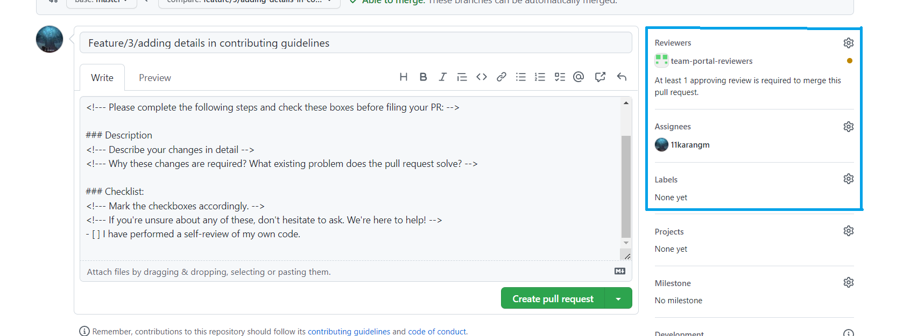
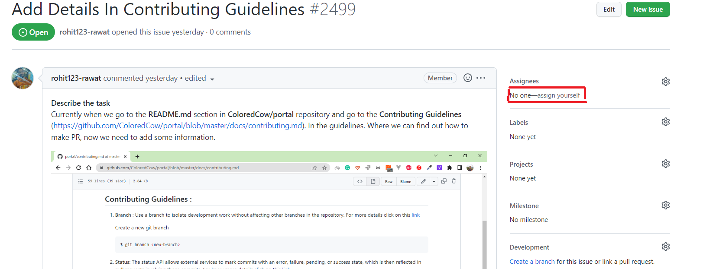
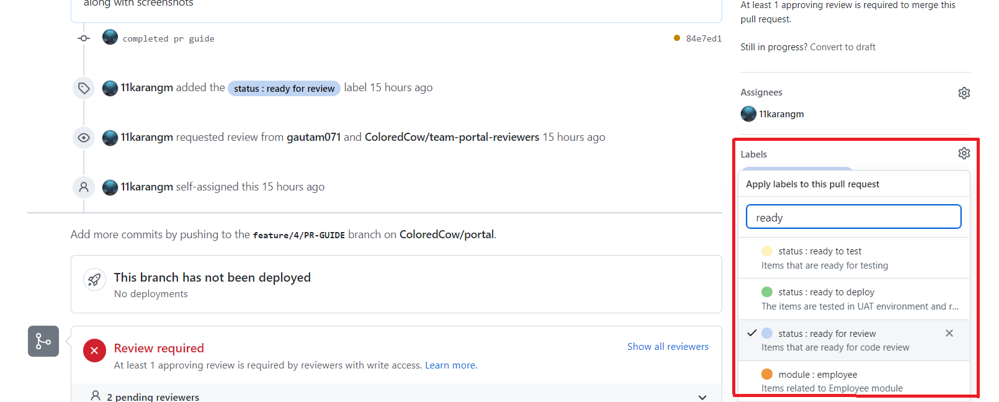
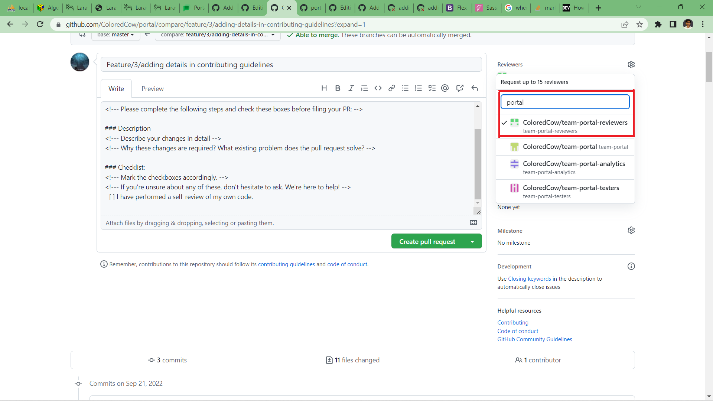

## Contributing Guidelines :

1. **Branch** : Use a branch to isolate development work without affecting other branches in the repository. For more details click on this [link](https://docs.github.com/en/pull-requests/collaborating-with-pull-requests/proposing-changes-to-your-work-with-pull-requests/about-branches)

   Create a new git branch

   ```sh
   $ git branch <new-branch>
   ```

2)  **Status**: The status API allows external services to mark commits with an error, failure, pending, or success state, which is then reflected in pull requests involving those commits. For know more details click on this [link](https://docs.github.com/en/rest/reference/commits#commit-statuses)

    Check the status of the repository

    ```sh
    $ git status
    ```

3)  **Staged** :To stage a changed or modified file, run
    ```sh
    git add <file_path>.<ext>
    ```
    To stage all modified files, run
    ```sh
    git add .
    ```
    For more details click on this [link](http://archaeogeek.github.io/foss4gukdontbeafraid/git/stages.html)
4)  **Commit** : The commits API allows you to list, view, and compare commits in a repository. You can also interact with commit comments and commit statuses.

    For commiting the changes.

    ```sh
    $ git commit -m "<your message here>"
    ```

    For more details click on this [link](http://archaeogeek.github.io/foss4gukdontbeafraid/git/stages.html#:~:text=output%20has%20changed%3A-,Commit,-The%20final%20stage)

    **Pushing commits to a remote repository**

    ```sh
    $ git push  <REMOTENAME> <BRANCHNAME>
    ```

    For more details click on this [link](https://docs.github.com/en/get-started/using-git/pushing-commits-to-a-remote-repository)

5)  **Pull requests** : Tell others about changes you've pushed to a branch in a repository on GitHub. For more details click on this [link](https://docs.github.com/en/pull-requests/collaborating-with-pull-requests/proposing-changes-to-your-work-with-pull-requests/about-pull-requests)

    (i) **For how to create the pull request** click on this [link](https://docs.github.com/en/pull-requests/collaborating-with-pull-requests/proposing-changes-to-your-work-with-pull-requests/creating-a-pull-request)

    (ii) **Creating a pull request from a fork** : You can create a pull request to propose changes you've made to a fork of an upstream repository.  
    For know how to create a pull request from a fork click on this [link](https://docs.github.com/en/pull-requests/collaborating-with-pull-requests/proposing-changes-to-your-work-with-pull-requests/creating-a-pull-request-from-a-fork)


# Merge Conflict :
 **Why merge conflict occurs and how to resolve that conflict** can go through the given links:

- [fix merge conflicts vscode](https://linuxpip.org/fix-merge-conflicts-vscode/)

- [How do i resolve merge conflicts](https://dev.to/github/how-do-i-resolve-merge-conflicts-5438)


**After creating pull request perform the following steps**

**Look on the Righ Hand Side**
<br><br><br>


6) **Self Assign** : On the right hand side under the 'Assignees' click on 'assign-yourself'

<br><br><br>


7) **Assigning Ready to review label** : On right hand side under assignees you will find 'Labels'.
    Click on 'Labels' and select 'status : ready for review'<br>
<br><br><br>


8) **Assigning Reviewers for review** : On the right hand side above 'Assignees' you can find 'Reviewers'.
   Click on 'Reviewers' and select 'team-portal-reviewers'
<br><br><br>
    
